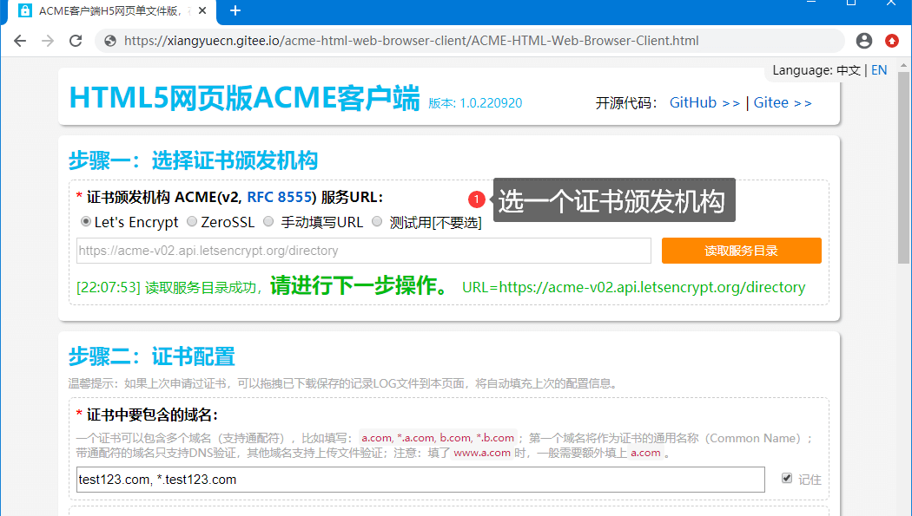
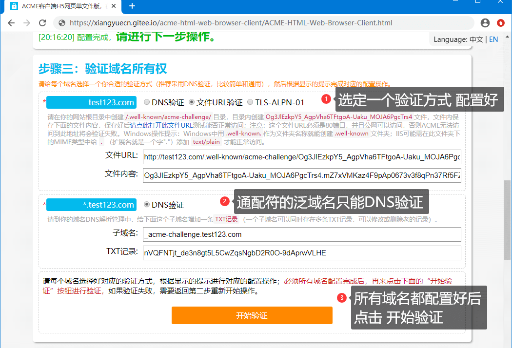
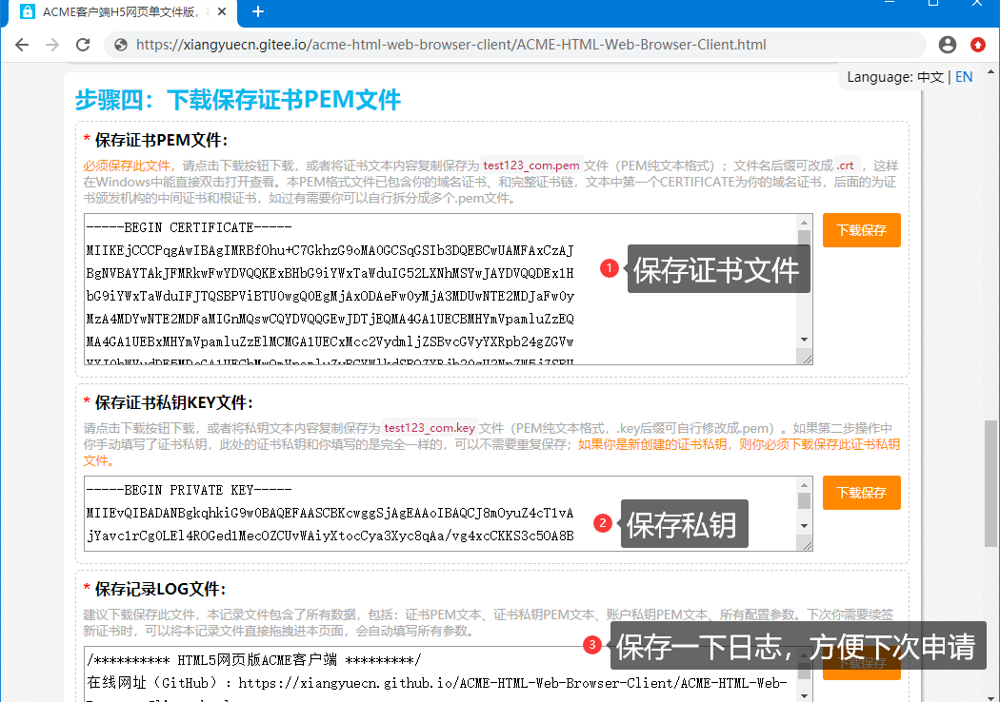

# 新开源HTML5单文件网页版ACME客户端，可在线申请Let’s Encrypt、ZeroSSL免费HTTPS多域名通配符泛域名SSL/TLS证书（RSA/ECC/ECDSA）

之前写了两篇关于HTTPS证书的文章，一篇是本地自签证书，另一篇是Let’s Encrypt开始支持免费通配符证书时通过`diafygi/gethttpsforfree`网页来申请证书，步骤均很繁琐；于2022年9月我写了我开发了一个操作非常简单的网页版ACME客户端：[ACME-HTML-Web-Browser-Client](https://xiangyuecn.gitee.io/acme-html-web-browser-client/ACME-HTML-Web-Browser-Client.html)，并在[GitHub](https://github.com/xiangyuecn/ACME-HTML-Web-Browser-Client)、[Gitee](https://gitee.com/xiangyuecn/ACME-HTML-Web-Browser-Client)上进行了开源。

整个源码仅一个静态HTML网页文件，可以直接保存到本地使用，或通过在线网址使用；支持向 `Let's Encrypt`、`ZeroSSL` 等支持 ACME 协议的证书颁发机构，免费申请获得用于 HTTPS 的 SSL/TLS 域名证书（`RSA`、`ECC/ECDSA`），支持多域名和通配符泛域名；只需在现代浏览器上操作即可获得 PEM 格式纯文本的域名证书，不依赖操作系统环境，无需下载和安装软件，无需注册登录，纯手动操作，**只专注于申请获得证书这一件事**。

> **证书过期风险提醒：**由于本网页客户端只能纯手动操作，不支持自动续期，需注意在证书过期前重新生申请新证书（免费证书普遍90天有效期，届时只需重复操作一遍即可），或使用 acme.sh 等客户端自动化续期。


# 开源项目的起源
我自己主要是在Windows里面用的多，并不介意甚至更偏向于纯手动操作获得证书，但官方ACME客户端列表里面的能单纯提供符合我需求的寥寥无几：依赖特定操作系统环境、需要安装特定的运行环境、要自己写代码开发、甚至有的还必须捆绑线上生产环境；**而我需求仅仅是单纯的想获得一个证书文件而已，但带来的是一整套全家桶，很难专注于只申请获得证书这一件事。**

常见的ACME客户端要么是需要`Bash`脚本环境，要么就是不同开发语言的源代码或者第三方库需要自己写代码；早先Let’s Encrypt的列表里面还有提供网页版的客户端列表（我在里面找到的`gethttpsforfree`），现在官方因为`“一些浏览器内 ACME 客户端可用，但我们未在此处列出它们，因为它们鼓励手动续订工作流程，这会导致糟糕的用户体验并增加错过续订的风险”`而不再展示网页版客户端列表，我很失望；也有部分支持Windows的桌面程序可以直接使用，比如`win-acme`，不过看了文档也很难上手；有部分客户端或网站甚至会要求注册并登陆账户才能使用，还帮你管理私钥（存储到他们的服务器，恨不得把通讯录都拿走），哈 ~ 呸 ~~

长时间我都是使用`fszlin/certes`这个.Net的库来签发证书，自己C#写的一个控制台程序，双击程序就能直接到达验证阶段，配置好DNS验证记录就能申请到证书文件，但要给别人用就麻烦了，要改C#代码；更重要的是EXE程序还有一个信任的问题，双击一个EXE程序需要承担的风险很大；**网页版就完全不同了，网页本身就带有很大程度的开放性，我们完全可以审查代码是否有加料，网页天然适合做UI，人机交互的友好性远超脚本控制台程序**，对于用不上自动化续期、或自动化在服务器进行部署证书的需求，在网页上进行申请是最理想的操作方式；比如`diafygi/gethttpsforfree`我们完全可以看到他的网页源码，还能通过浏览器控制台完全监控到网络数据流向，最为简单和可靠，虽然这个网页也是开源的，但它需要的操作太繁琐了，早先我还给他提了个我自己在用的简化签名操作的方法 [issues/164](https://github.com/diafygi/gethttpsforfree/issues/164) 。


为了能用上一个符合我心里预期的并且操作简单的网页版ACME客户端，依托于现代浏览器对`RSA`、`ECC`加密、签名的直接支持，**因此我决定自己写！**好在以前积累了点基础的密码学知识，编写本客户端不存在知识盲点，很顺利的写完了全部HTML代码，并进行了开源。

# 项目地址
`GitHub:` [https://github.com/xiangyuecn/ACME-HTML-Web-Browser-Client](https://github.com/xiangyuecn/ACME-HTML-Web-Browser-Client)
`Gitee:` [https://gitee.com/xiangyuecn/ACME-HTML-Web-Browser-Client](https://gitee.com/xiangyuecn/ACME-HTML-Web-Browser-Client)

在线使用本客户端：
`国内访问gitee.io:` [https://xiangyuecn.gitee.io/acme-html-web-browser-client/ACME-HTML-Web-Browser-Client.html](https://xiangyuecn.gitee.io/acme-html-web-browser-client/ACME-HTML-Web-Browser-Client.html)
`不太稳定github.io:` [https://xiangyuecn.github.io/ACME-HTML-Web-Browser-Client/ACME-HTML-Web-Browser-Client.html](https://xiangyuecn.github.io/ACME-HTML-Web-Browser-Client/ACME-HTML-Web-Browser-Client.html)


## 使用方法
这里介绍的是完整的操作流程，请根据步骤进行操作，很容易就能申请得到证书文件；本文图片中显示的数据都是演示用的并非真实数据。

### 第一步：选择Let’s Encrypt、ZeroSSL或其他证书颁发机构
根据上面的项目地址，打开本网页客户端（下载保存唯一的这一个html文件并双击打开、或者使用在线网址）；只要是支持ACME协议的证书颁发机构，都可以在第一步操作中填写对应地址，目前默认提供了`Let’s Encrypt`、`ZeroSSL`两家的地址，根据自己需要直接选择即可。

> 不同证书颁发机构需要的操作不一定相同，请根据提示进行操作；`Let’s Encrypt`直接到第二步操作，`ZeroSSL`由于他们的ACME服务对浏览器支持很不友好存在跨域问题，需要多操作几下（复制源码到他们服务地址页面中运行，消除跨域问题）。



### 第二步：证书配置，填写域名
在网页的第二步中填写需要申请证书的域名（支持多域名、通配符），和密钥等信息配置；不同证书颁发机构需要填写的配置不一定相同，请根据提示进行操作。

**填写域名列表：**比如要给你的域名`test123.com`申请证书，在域名中可以直接填写：`test123.com, *.test123.com`，带了一个通配符，这申请出来的证书在`test123.com`、`www.test123.com`、`app.test123.com`等域名都可以使用。注意：如果需要`xxx.app.test123.com`这种域名也能使用，需增加填写`*.app.test123.com`类似这种才行。

**证书私钥：**建议直接点击创建新的RSA私钥。

**ACME账户私钥：**如果你之前申请过，建议填写之前用过的私钥，没有申请过也同样的创建新的RSA私钥。

**ACME联系邮箱：**填写一个你常用的邮箱，证书颁发机构会在证书到期前给你推送邮件提醒续期，乱填邮箱收不到提醒。

**EAB凭据：**有些ACME服务会要求提供外部账号绑定凭据（`External Account Binding`、`externalAccountBinding`、`externalAccountRequired`），比如ZeroSSL：你可以在ZeroSSL的管理控制台的 Developer 中获得此凭据，所以你需要先注册一个ZeroSSL的账号；Let’s Encrypt没有此选项。


### 第三步：完成域名所有权的验证
根据网页内显示的第三步内容，给每个域名配置好合适的域名所有权验证方式；常见的验证方式有：DNS解析中配置TXT记录进行验证、上传文件到服务器进行验证，通配符域名一般仅支持DNS验证；等全部配置完成后开始验证，验证通过后就能下载得到证书了。

**推荐使用DNS验证方式**，只需要登录你的域名解析管理后台，在域名解析中填写子域名TXT记录就行，简单快捷，并且不容易出错；比如`*.test123.com`，我们需要给子域名`_acme-challenge.test123.com`添加一条TXT记录（这一个子域名下可以添加多条TXT记录）。

**通过上传文件来验证**，不太推荐这个方式，因为必须要有服务器，不然ACME访问不到文件就会验证不通过；为了让上传的文件能正常访问，可能需要在服务器内进行一些配置（请自行搜索解决办法），测试URL地址你自己也能正常访问后，才能开始验证。




### 第四步：下载保存证书PEM文件
等域名所有权验证通过后，网页会显示第四步，提供证书文件下载，下载保存好；有3个文件需要下载（都是纯文本，可以用记事本打开）：
1. 证书文件（含完整证书链）
2. 证书私钥文件
3. 日志记录文件，下次申请时直接拖拽此文件进页面，自动填写相同配置

证书文件的后缀`.pem`可以改成`.crt`或`.cer`，这样在Windows里面可以直接双击打开查看此证书。

最后将下载保存的证书和私钥配置到你的网站中即可，不同系统程序的配置方法不同，请自行查找对应配置方法。




# 源码中一些可以把玩的代码
为了在浏览器上实现`RSA`、`ECC`签名操作，源码中用纯js代码实现了：
- `PKCS#1`的解析，PEM格式公钥和私钥
- `PKCS#8`的解析和生成，PEM格式公钥和私钥
- `PKCS#10`的生成，PEM格式证书请求CSR文件(Certification Request)

对应的功能封装在本客户端内的 `X509` 对象中，用 X509.CreateCSR 来生成CSR，用 X509.KeyGenerate 来创建PEM格式密钥，用 X509.KeyParse 来解析PEM格式密钥，用 X509.KeyExport 来导出PEM格式密钥。

这些功能都是根据相应的标准用js代码在二进制层面上实现的，二进制数据操作封装在了 `ASN1` 对象中：实现了 ASN.1 标准的二进制解析和封包，使用 ASN1.ParsePEM 方法可以解析任意的PEM格式密钥或证书。

**请打开本网页客户端，在浏览器控制台内执行一下代码观赏：**
``` javascript
console.log("生成一个512位的RSA私钥 PKCS#8：");
X509.DefaultType2_RSA="512";
privateKey=await new Promise(function(resolve,reject){
	X509.KeyGenerate("RSA", function(pem){resolve(pem)}, function(err){reject(new Error(err))})
});
console.log(privateKey);

console.log("解析一个pem格式密钥：");
keyInfo=await new Promise(function(resolve,reject){
	X509.KeyParse(privateKey, function(info){resolve(info)}, function(err){reject(new Error(err))})
});
console.log(keyInfo);

console.log("导出私钥的公钥 PKCS#8：");
publicKey=X509.KeyExport(keyInfo, true);
console.log(publicKey);

console.log("用私钥创建一个证书请求CSR PKCS#10：");
csr=await new Promise(function(resolve,reject){
	X509.CreateCSR(keyInfo, "test123.com"
		, ["test.com","*.test.com","*.app.test.com","test123.com","*.test123.com"]
		, function(csr){resolve(csr)}, function(err){reject(new Error(err))})
});
console.log(csr);

console.log("用ASN1解析CSR得到二进制结构：");
csrASN1=ASN1.ParsePEM(csr);
console.log(csrASN1);

console.log("用ASN1解析私钥得到二进制结构：");
privateKeyASN1=ASN1.ParsePEM(privateKey);
console.log(privateKeyASN1);

console.log("用ASN1解析公钥得到二进制结构：");
publicKeyASN1=ASN1.ParsePEM(publicKey);
console.log(publicKeyASN1);
```

【END】
